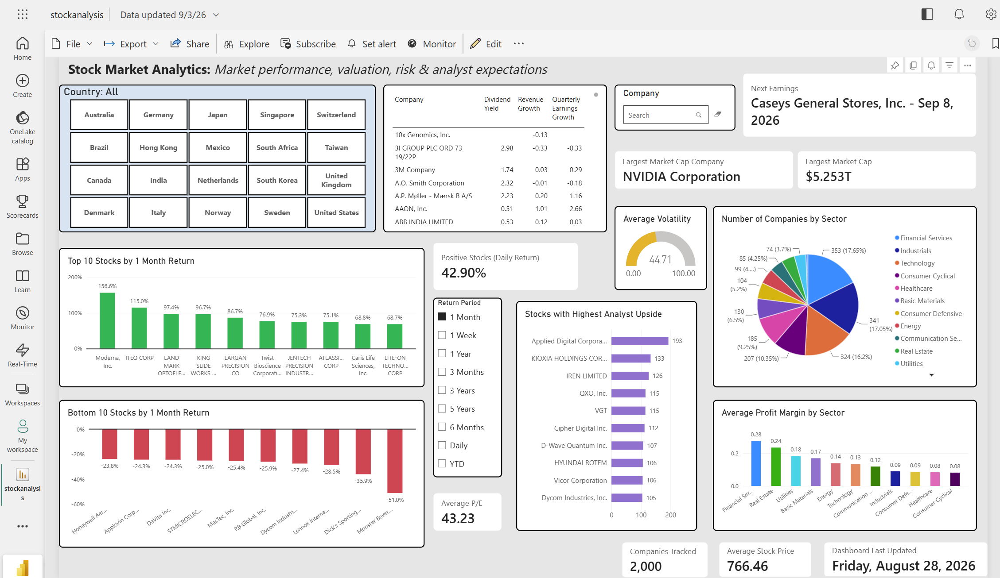
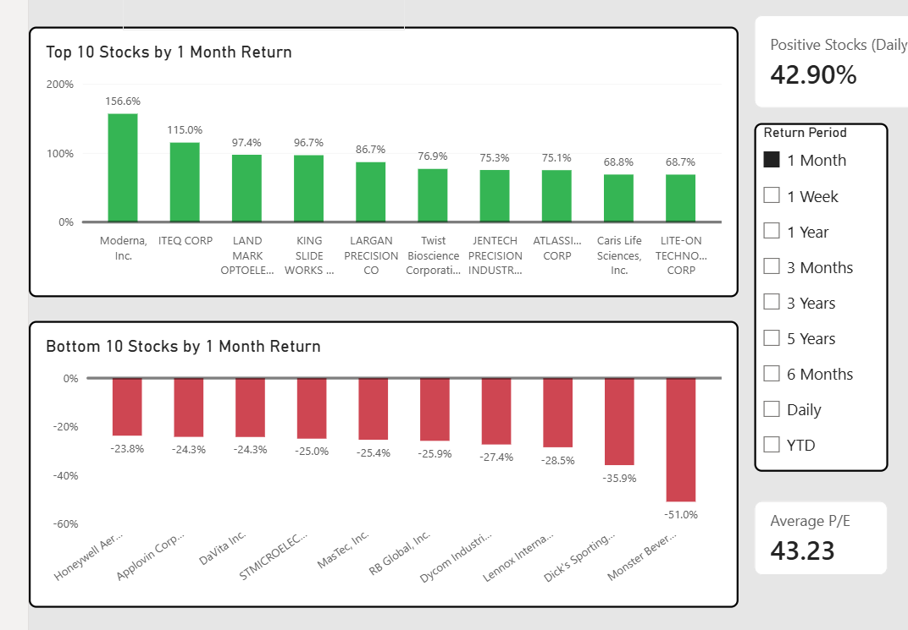
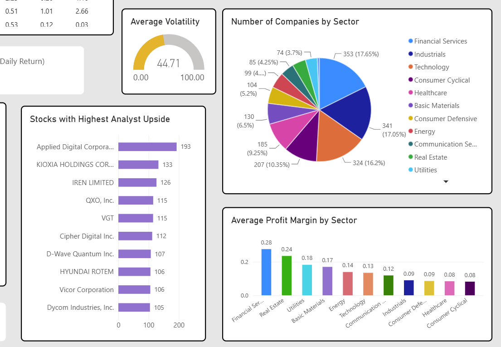

# 📊 Stock Market Analytics Dashboard

An end-to-end **data analytics / data engineering** project that collects, processes, and models publicly traded company data, then delivers it through an interactive **Power BI** dashboard for stock research and screening.

Built with **Python → PostgreSQL → Power BI**, this project goes beyond visualization — it demonstrates a complete data pipeline, from raw data collection to a production-style BI report published to Power BI Service with scheduled refreshes.

> ⚠️ **Disclaimer:** This dashboard is an analytical and research tool. It is **not financial advice**. Metrics are intended to help users identify companies for further research, not to recommend buying or selling any security.

---

## 🖼️ Dashboard Preview


*Full dashboard view — market performance, valuation, profitability, dividends, volatility, growth, and analyst metrics in one place.*

🔗 **[View the Interactive Power BI Dashboard](#)** <!-- Replace # with your published Power BI Service link -->

---

## 🎯 Project Overview

The **Stock Market Analytics Dashboard** helps users analyze a broad universe of publicly traded companies and identify potentially attractive stocks to research further.

Rather than focusing on a single company, the dashboard is built as a **screening tool** — allowing users to filter, rank, and compare companies across multiple dimensions:

- 📈 Market Performance
- 💰 Valuation
- 🏭 Profitability
- 🌱 Growth
- 💵 Dividends
- ⚡ Volatility / Risk
- 🎯 Analyst Expectations

The pipeline follows a classic analytics engineering flow:

```
Python (Collect & Process) → PostgreSQL (Store & Organize) → Power BI (Model & Visualize)
```

Python is used to collect and clean financial/market data. Processed data is loaded into a PostgreSQL database, which powers a Power BI report containing custom DAX measures, dynamic filters, and interactive visualizations. The report is published to **Power BI Service** and configured for scheduled data refreshes.

---

## ✨ Key Features

<table>
<tr>
<td width="50%" valign="top">

**🔎 Screening & Filtering**
- Tile-based country slicer
- Company search box with results table (dividend yield, quarterly earnings growth, revenue growth)
- Dynamic return-period selector (Daily, 1W, 3M, 6M, 1Y, 3Y, 5Y, YTD)

**📊 Performance**
- Top 10 stocks by return
- Bottom 10 stocks by return
- % of stocks with a positive daily return

</td>
<td width="50%" valign="top">

**🧮 Valuation & Risk**
- Average P/E ratio
- Average 30-day volatility gauge (with threshold zones)
- Highest analyst price-target upside

**🏢 Company & Sector Insights**
- Companies tracked (count)
- Average stock price
- Largest market cap (company + value)
- Number of companies by sector
- Average profit margin by sector
- Next earnings date (within 100 days)
- Last data update timestamp

</td>
</tr>
</table>


*Top 10 and Bottom 10 stocks by return, with a dynamically selectable time period.*


*Sector distribution, average volatility gauge, analyst upside, and sector-level profit margins.*

---

## 🧭 Key Analytical Areas

| Area | What It Answers |
|---|---|
| **Market Performance** | How have stocks performed across different time horizons? |
| **Valuation** | How expensive is a stock relative to its earnings (P/E)? |
| **Profitability** | How profitable are companies, individually and by sector? |
| **Growth** | How fast are revenue and earnings growing? |
| **Dividends** | Which companies offer attractive income potential? |
| **Risk** | How volatile is a stock's price relative to others? |
| **Analyst Expectations** | How much upside do analysts project relative to current price? |

---

## 🛠️ Technology Stack

| Layer | Tools |
|---|---|
| **Data Collection & Processing** | Python, Pandas, yfinance |
| **Database** | PostgreSQL, SQL |
| **Visualization & Modeling** | Power BI, DAX |

---

## 🔄 Data Pipeline

```
build_stock_dataset.py → stock_snapshot.csv → move_to_sql.py → PostgreSQL (stock_data) → Power BI
```

1. **Collect & Process** — `build_stock_dataset.py` screens global and US-listed exchanges via `yfinance`, builds a deduplicated company universe ranked by USD market cap, and pulls 5 years of historical price data
2. **Calculate** — Computes returns (Daily → 5Y), technical indicators (SMA/EMA/RSI/ATR), volatility, drawdown, and volume metrics, plus fundamental data (valuation, profitability, growth, dividends, analyst targets)
3. **Normalize** — Converts price and fundamental values to USD using historical FX rates, and outputs `stock_universe.csv` and `stock_snapshot.csv`
4. **Load** — `move_to_sql.py` loads `stock_snapshot.csv` into the `stock_data` table in a local PostgreSQL database (`stockdash`), replacing the table with each run
5. **Connect** — Power BI connects to PostgreSQL via the native connector
6. **Model** — DAX measures power KPIs, rankings, and dynamic dashboard behavior
7. **Publish & Refresh** — The report is published to Power BI Service with scheduled refreshes

### Script Reference

| Script | Role |
|---|---|
| **`build_stock_dataset.py`** | ✅ Current/primary pipeline. Builds the stock universe, downloads pricing & fundamentals, calculates all returns/technicals/valuation metrics, converts to USD, outputs `stock_universe.csv` and `stock_snapshot.csv`. This is the source of truth for the dataset. |
| **`move_to_sql.py`** | Loads `stock_snapshot.csv` into PostgreSQL (`stockdash.stock_data`), replacing the table on each run so Power BI always reflects the latest snapshot. |
| **`convert_usd.py`** | Standalone USD conversion workflow — reads `stock_snapshot.csv`, derives currency from exchange, pulls historical FX rates, and outputs `stock_snapshot_usd.csv`. Independent of the USD conversion already built into `build_stock_dataset.py`; used only when needed separately. |
| **`1stock.py`** | Earlier/reference version of the collection script (uses `yfinance` screening, an earlier deduplication approach). Kept for historical reference — **not** part of the active pipeline. |

> **Note:** `build_stock_dataset.py` is the active data source. `1stock.py` is historical reference code and `convert_usd.py` is a separate, optional USD-conversion utility — neither should be assumed to be part of the current production pipeline.

---

## 📁 Repository Structure

```
stock-market-analytics-dashboard/
│
├── screenshots/
│   ├── mainview.png              # Full dashboard overview
│   ├── topbottom10.png           # Top/Bottom 10 return charts
│   └── sector.png                # Sector, volatility & analyst upside visuals
│
├── build_stock_dataset.py        # ✅ Primary pipeline: universe build, metrics, USD conversion
├── move_to_sql.py                # Loads stock_snapshot.csv into PostgreSQL
├── convert_usd.py                # Standalone/optional USD conversion workflow
├── 1stock.py                     # Earlier version of the collection script (reference only)
│
├── stock_universe.csv            # Output: full company universe
├── stock_snapshot.csv            # Output: primary dataset loaded into PostgreSQL
├── stock_snapshot_usd.csv        # Output: USD-converted dataset (from convert_usd.py)
│
├── stockanalysis.pbix            # Power BI report file
│
└── README.md
```

---

## ⚙️ Setup & Usage

### Prerequisites
- Python 3.9+
- PostgreSQL 13+
- Power BI Desktop

### 1. Clone the repository
```bash
git clone https://github.com/<your-username>/stock-market-analytics-dashboard.git
cd stock-market-analytics-dashboard
```

### 2. Set up the Python environment
```bash
pip install -r requirements.txt
```

### 3. Generate the dataset
Run the primary pipeline script to build the stock universe and calculate all metrics:
```bash
python build_stock_dataset.py
```
This produces `stock_universe.csv` and `stock_snapshot.csv`.

> Need a standalone USD conversion pass? Run `python convert_usd.py` — this is a separate, optional utility and is not required if you're using `build_stock_dataset.py`'s built-in USD conversion.

### 4. Load into PostgreSQL
- Create a local PostgreSQL database named `stockdash` (or update the connection settings in `move_to_sql.py` to match your own)
- Run:
```bash
python move_to_sql.py
```
This loads `stock_snapshot.csv` into the `stock_data` table, replacing it with the latest snapshot each time it runs.

### 5. Connect Power BI
- Open `stockanalysis.pbix` in Power BI Desktop
- Update the PostgreSQL data source connection to point to **your own** database
- Refresh the report

> **📌 Note on the `.pbix` file:** The included `.pbix` contains the Power BI report along with a snapshot of the data at the time of export. The report itself is configured to connect to a **local PostgreSQL database**, so if you download this file, you will need to set up your own PostgreSQL database and update the data source connection before you can refresh the data. The downloaded file **cannot** refresh directly against the original database used to build this project.

---

## 📌 Notes

- The live dashboard is published to **Power BI Service** with scheduled refreshes against the local PostgreSQL instance.
- This project is intended to showcase a full analytics engineering workflow — data collection, transformation, storage, and visualization — not just the final report.

---

## 📄 License

This project is for educational and portfolio purposes. Data is sourced from publicly available financial data providers and is intended for research and analysis only.
